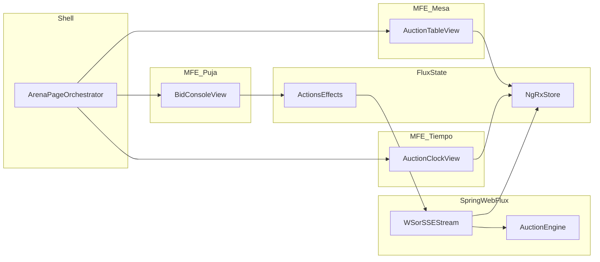

# Entrega Final - Arquitectura de Microfrontends para Live Bid Arena

## Portada

**Programa:** Arquitectura Frontend  
**Actividad:** Entrega final - Evolucion arquitectonica con microfrontends  
**Proyecto:** Live Bid Arena  
**Estudiante:** Kevin Rodriguez  
**Fecha:** [Completar]  
**Docente:** [Completar]

---

## Tabla de contenido

1. Resumen ejecutivo  
2. Contexto de crecimiento organizacional  
3. Problema arquitectonico de partida  
4. Justificacion estrategica de microfrontends  
5. Dominios funcionales y limites de responsabilidad  
6. Estrategia de integracion (comparativo y decision)  
7. Arquitectura objetivo y flujo tecnico  
8. Prototipo funcional y evidencia tecnica  
9. Gobernanza, calidad y escalabilidad  
10. Reflexion critica y aprendizajes  
11. Conclusiones  
12. Anexos (guia de video y repositorio)

---

## 1) Resumen ejecutivo

Esta entrega propone la evolucion de la aplicacion `Live Bid Arena` desde un frontend centralizado hacia una arquitectura orientada a microfrontends por dominio. El objetivo no es unicamente separar componentes visuales, sino establecer una base arquitectonica alineada con crecimiento organizacional, autonomia de equipos y gobernanza tecnica.

La propuesta selecciona composicion en cliente mediante un Shell y microfrontends de dominio, manteniendo un flujo de estado unidireccional (Flux/NgRx) y una fuente de verdad sincronizada para la logica de subasta en tiempo real. Como resultado, se obtiene un prototipo funcional demostrable que evidencia desacoplamiento, separacion de responsabilidades y evolucion progresiva hacia despliegues independientes.

---

## 2) Contexto de crecimiento organizacional

### 2.1 Escenario hipotetico de crecimiento

Se plantea un crecimiento de la plataforma en tres fases:

- **Fase 1 (actual):** producto unico con funcionalidad principal de subasta en tiempo real.
- **Fase 2 (expansion):** nuevos flujos de negocio: lobby dinamico, reglas comerciales por segmento, monitoreo de sesiones y panel operativo.
- **Fase 3 (escala):** equipos separados por capacidades de negocio, releases mas frecuentes y mayor complejidad de integracion.

En este contexto, mantener un frontend monolitico aumenta:

- dependencias entre equipos,
- tiempos de integracion y prueba,
- riesgo de regresiones cruzadas,
- dificultad de gobernanza en decisiones de UI y estado.

### 2.2 Necesidad arquitectonica

La organizacion necesita un modelo que permita:

- evolucion independiente por dominio,
- estandar de integracion claro,
- consistencia de experiencia,
- menor acoplamiento estructural,
- y despliegue progresivo sin reescritura total.

---

## 3) Problema arquitectonico de partida

La aplicacion ya contaba con una base tecnica robusta de UI reactiva y estado centralizado. Sin embargo, desde una perspectiva arquitectonica, existia una limitacion: la composicion estaba concentrada en una unica feature principal.

Para cumplir con la actividad final, el foco debia cambiar de “mejoras visuales/tecnicas” a “capacidad de evolucion organizacional”. Por ello se definio una transicion a microfrontends por dominio, manteniendo coherencia con los contratos existentes de estado y eventos.

Estado de partida relevante del codigo:

- Shell de aplicacion y rutas en `src/app/app.routes.ts`.
- Estado global y acciones de subasta en `src/app/store/auction/`.
- Vista de arena como orquestador en `src/app/features/auction/pages/arena/`.

---

## 4) Justificacion estrategica de microfrontends

La adopcion de microfrontends se justifica por criterios estrategicos, no por moda tecnica:

### 4.1 Alineacion negocio-equipo

Los microfrontends se organizan por dominio de negocio, permitiendo que cada equipo evolucione su capacidad (p. ej. “Mesa”, “Puja”, “Lobby”) con menor dependencia de los ciclos de otro equipo.

### 4.2 Reduccion de acoplamiento

Cada dominio expone una interfaz de integracion (inputs/eventos/contratos). Esto evita que la evolucion interna de un dominio rompa la aplicacion completa.

### 4.3 Escalabilidad evolutiva

Se habilita una ruta incremental:

1) separacion por dominio en monorepo (estado actual del prototipo),  
2) federacion y despliegue independiente (siguiente etapa),  
3) gobernanza madura por versionado de contratos.

### 4.4 Gobernanza tecnica

La arquitectura define limites claros: quien publica contratos, quien consume, y como se verifican cambios. Esto reduce deuda de integracion y mejora trazabilidad de decisiones.

---

## 5) Dominios funcionales y limites de responsabilidad

Se delimitaron dominios siguiendo cohesión funcional y baja dependencia cruzada:

### 5.1 Dominio Shell (orquestacion)

- Routing principal.
- Composicion de microfrontends.
- Reglas globales de layout y experiencia comun.
- No concentra logica interna de cada dominio.

### 5.2 Dominio Mesa de subasta (MFE Mesa)

- Visualizacion del estado de la subasta.
- Informacion de precio, fase, participantes y ganador.
- Render de la “mesa” y estado competitivo.

Implementacion actual:

- `src/app/features/auction/microfrontends/mfe-auction-table/`

### 5.3 Dominio Interaccion de puja (MFE Puja)

- Acciones de puja del usuario.
- Estados de habilitacion/inhabilitacion por fase.
- Presentacion de capacidad de puja del usuario.

Implementacion actual:

- `src/app/features/auction/microfrontends/mfe-bid-console/`

### 5.4 Dominio Tiempo / reloj de cierre

- Presentacion de countdown y urgencia operacional.
- Semantica visual por estado (`ACTIVE`, `FINISHED`, critico).

Implementacion actual:

- `src/app/features/auction/components/auction-clock/`

Nota: actualmente este dominio esta como componente presentacional independiente. En evolucion futura puede migrar a microfrontend remoto dedicado.

---

## 6) Estrategia de integracion (comparativo y decision)

Se evaluaron tres estrategias:

### 6.1 Integracion por cliente (Shell + Microfrontends)

**Ventajas**
- Alta flexibilidad de UX compuesta.
- Mejor experiencia para flujos interactivos en tiempo real.
- Facil evolucion incremental desde estado actual.

**Desventajas**
- Exige disciplina de contratos y versionado.
- Mayor complejidad de build/deploy al madurar.

### 6.2 Composicion por servidor

**Ventajas**
- Control centralizado de entrega.
- Menor complejidad inicial de cliente.

**Desventajas**
- Menor autonomia real por dominio frontend.
- Escalado de equipos mas acoplado al servidor.

### 6.3 Integracion por iframe

**Ventajas**
- Aislamiento fuerte por app.
- Implementacion rapida.

**Desventajas**
- UX fragmentada.
- Dificultad de comunicacion y consistencia visual.
- Limitaciones para experiencia rica en tiempo real.

### 6.4 Decision adoptada

Se adopta **integracion por cliente** con Shell y microfrontends por dominio, por su mejor equilibrio entre autonomia, experiencia de usuario y evolucion gradual para el contexto del proyecto.

---

## 7) Arquitectura objetivo y flujo tecnico

### 7.1 Arquitectura logical

### 7.2 Flujo de estado

1. Usuario ejecuta `PLACE_BID` desde MFE Puja.  
2. El flujo de acciones/efectos envia comando al backend reactivo.  
3. Backend valida y publica nuevo estado.  
4. Store recibe estado sincronizado.  
5. Shell propaga estado a MFE Mesa y MFE Tiempo.  
6. UI se actualiza sin recarga.

### 7.3 Consistencia con Flux

La arquitectura conserva flujo unidireccional:

- intencion del usuario -> accion,
- procesamiento -> efecto/servicio,
- nuevo estado -> reducer/store,
- render reactivo -> vistas.

---

## 8) Prototipo funcional y evidencia tecnica

### 8.1 Que se implemento en codigo

Se materializo una mini demo arquitectonica con:

- Shell de composicion en `src/app/features/auction/pages/arena/`.
- Microfrontend de mesa en `src/app/features/auction/microfrontends/mfe-auction-table/`.
- Microfrontend de puja en `src/app/features/auction/microfrontends/mfe-bid-console/`.
- Componente de tiempo desacoplado en `src/app/features/auction/components/auction-clock/`.

### 8.2 Evidencia de desacoplamiento

- Los dominios de mesa y puja tienen wrapper propio, template propio y estilos propios.
- El shell orquesta, pero no absorbe la implementacion visual interna de cada dominio.
- La estructura permite evolucionar a remotos reales sin rediseño funcional.

### 8.3 Evidencia funcional para video

Se puede demostrar en video:

- entrada al lobby y seleccion de mesa,
- visualizacion de estado de subasta en tiempo real,
- pujas y actualizacion reactiva,
- bloqueo al finalizar y visualizacion de ganador,
- separacion visual/estructural de microfrontends por dominio.

---

## 9) Gobernanza, calidad y escalabilidad

### 9.1 Contratos y versionado

Se recomienda formalizar contratos compartidos:

- DTOs de estado de subasta.
- Eventos de comando/estado.
- Convenciones de versionado semantico.

### 9.2 Politicas de equipo

- cada dominio conserva ownership de su microfrontend,
- cambios de contrato requieren revision cruzada,
- pruebas de integracion en shell antes de release.

### 9.3 Ruta de evolucion

**Paso actual (cumplido):** separacion por dominio en una base unificada.  
**Paso siguiente:** host + remotes con federation real y despliegues separados.  
**Paso objetivo:** independencia de release por dominio.

---

## 10) Reflexion critica y aprendizajes

### 10.1 Decisiones acertadas

- Priorizar dominios de negocio sobre separacion por capas tecnicas.
- Mantener Flux para coherencia de estado en experiencia en tiempo real.
- Aplicar evolucion incremental en lugar de reescritura abrupta.

### 10.2 Limitaciones identificadas

- El prototipo actual aun no implementa remotos desplegados de manera independiente.
- No se incluyo autenticacion en esta fase por alcance y tiempo.
- Se requiere mayor madurez de gobernanza de contratos para escalar equipos.

### 10.3 Aprendizajes

- La arquitectura se valida por capacidad de evolucion organizacional, no solo por complejidad tecnica.
- Microfrontends sin limites de dominio claros solo fragmentan; con limites claros, habilitan autonomia.
- El valor principal no es “dividir UI”, sino reducir acoplamiento de decisiones de negocio.

---

## 11) Conclusiones

La propuesta cumple el objetivo de transicionar hacia una vision arquitectonica de microfrontends:

- existe justificacion estrategica de adopcion,
- se definieron dominios funcionales delimitados,
- se escogio y sustento estrategia de integracion por cliente,
- se desarrollo un prototipo funcional coherente con la estrategia,
- y se documento una reflexion critica con ruta de evolucion.

En consecuencia, la entrega no se limita a una mejora tecnica puntual, sino que establece una base de arquitectura escalable y gobernable para crecimiento organizacional.

---

## 12) Anexos

### 12.1 Enlace a repositorio

- Repositorio: [Agregar URL del repositorio]

### 12.2 Enlace a video de demostracion

- Video: [Agregar URL del video]

### 12.3 Checklist de validacion para la sustentacion

- Se muestra shell y composicion de microfrontends por dominio.
- Se explica por que se eligio integracion en cliente.
- Se comparan estrategias (cliente/servidor/iframe).
- Se evidencia flujo reactivo de estado.
- Se presenta reflexion de trade-offs y evolucion futura.

